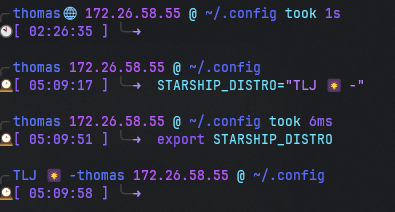

# Dynamic-Dotfiles

## Sections:

- [For Windows](#for-windows) -> Powershell / Zsh
- [For Linux](#for-linux) -> nushell
- [For Mac](#for-mac) -> Zsh
  `Change the "STARSHIP_DISTRO" variable in the zshrc file to your distro-name or $ENV:STARSHIP_DISTRO = in PS.`

  

  Please note, this is stylized for my personal wants and needs.

---

## For Windows:

Run the [powershell script ](/windows/InstallChocolateyAndCreateProfile.ps1) in the Windows folder, this will create a Powershell profile for you with the correct settings. You can use the zshrc and BashRC files in the windows subsystem for Linux. You can also use the powershell profile to set up your Windows terminal.

Assuming you're using the Starship config supplied, your terminal will look like this:

Note: Top Left is Powershell, Right is WSL2, Bottom is PowerShell in SSH to a remote server.

&nbsp;

---

## For Mac:

The script, [Mac init script](/mac/mac-init.sh), is for setting up a Mac from scratch. It will install everything needed to get started. It will also install the dotfiles and set up the terminal. It will also install the Homebrew packages and casks needed.

### Manually import the iterm2 profile in the mac folder.

Assuming you're using the Starship config supplied, your terminal will look like this:

&nbsp;

---

## For Linux:

Use the install script!

&nbsp;

&nbsp;

&nbsp;
